# Platforma typerska YLO BetLeague

## 1. Cel i istota platformy
**YLO BetLeague** to zaawansowana aplikacja internetowa, która przenosi emocje towarzyszące zakładom sportowym w świat bezpiecznej rywalizacji. Platforma przejmuje intuicyjną mechanikę znanych serwisów bukmacherskich, ale całkowicie zmienia reguły gry: zamiast realnych pieniędzy, stawką są tu punkty. To przestrzeń stworzona dla pasjonatów piłki nożnej i analityki, którzy chcą sprawdzić swoją wiedzę, śledzić statystyki i udoskonalać umiejętności prognozowania wyników bez żadnego ryzyka finansowego.

Projekt rozwiązuje problem braku bezpiecznej alternatywy dla osób chcących rywalizować w typowaniu sportowym. Użytkownik nie odczuwa stresu związanego z hazardem, ponieważ w YLO BetLeague ciężar rozgrywki przeniesiony jest na pozycję w rankingach oraz satysfakcję z trafnych analiz. Jest to miejsce dla osób szukających merytorycznego wyzwania, gdzie liczy się czysta pasja i umiejętność przewidywania, a nie chęć zysku.

### Wyróżniki platformy
Choć sposób obstawiania nawiązuje do tradycyjnych modeli bukmacherskich, YLO BetLeague definitywnie odróżnia się od nich modelem działania:

* **Bezpieczna alternatywa:** W przeciwieństwie do komercyjnych serwisów nastawionych na finansowy zysk, platforma stawia na rozwój kompetencji analitycznych. Środowisko jest w pełni wolne od ryzyka pieniężnego, co pozwala skupić się wyłącznie na zabawie.
* **Społeczność zamiast usług:** Tradycyjny bukmacher to jednokierunkowa relacja klient-firma. YLO BetLeague tworzy dynamiczną społeczność. Dzięki systemom rankingów, kodom polecającym oraz możliwości przeglądania typów innych graczy, użytkownicy wchodzą w interakcje, rywalizują w grupach i wspólnie tworzą angażującą atmosferę współzawodnictwa.
* **Typowanie oparte na danych:** System promuje świadome podejście do sportu. Wykorzystanie zautomatyzowanych narzędzi pozwala użytkownikom budować renomę w ramach społeczności w oparciu o twarde dane, a nie przypadek.

## 2. Wymagania środowiskowe

Poniższa tabela przedstawia szczegółowe wersje technologii wykorzystanych w projekcie. Zapewnienie zgodności z tymi wersjami jest niezbędne do poprawnego działania aplikacji.

| Komponent | Technologia | Wersja | Oficjalna strona |
| :--- | :--- | :--- | :--- |
| **Backend** | PHP | 8.5.3 | [php.net](https://www.php.net/) |
| **Framework** | Laravel | 13.3.0 | [laravel.com](https://laravel.com/) |
| **Baza danych** | SQLite | 3.x (wbudowana w PHP / system) | [sqlite.org](https://www.sqlite.org/) |
| **Silnik danych** | Python | 3.12.10 | [python.org](https://python.org/) |
| **Zarządzanie PHP** | Composer | 2.9.5 | [getcomposer.org](https://getcomposer.org/) |
| **Framework CSS** | Bootstrap | 5.3.0 | [getbootstrap.com](https://getbootstrap.com/) |
| **Ikony** | Bootstrap Icons | 1.11.0 | [icons.getbootstrap.com](https://icons.getbootstrap.com/) |
| **Slider** | Swiper.js | 11.x | [swiperjs.com](https://swiperjs.com/) |

## 3. Wymagania programowe

Do uruchomienia i rozwijania projektu w trybie deweloperskim wymagane jest zainstalowanie poniższych narzędzi:

### System operacyjny
* Projekt był rozwijany i testowany w systemie **Windows 11**.

### Środowisko programistyczne
* **Edytor kodu (PHP/Frontend):** Visual Studio Code w wersji 1.121.0.
* **Edytor kodu (PythonEngine):** PyCharm w wersji 2025.2.3.

### Skład środowiska bazodanowego
* **Baza danych:** SQLite (plik lokalny `.sqlite`, bez serwera bazodanowego)
* **Sterowanie bazą:** realizowane przez Laravel (migracje + seedery)

## Proces instalacji
Poniższy przewodnik opisuje proces instalacji, konfiguracji oraz pierwszego uruchomienia kompletnego środowiska aplikacji opartego o PHP oraz SQLite.

### Krok 1: Klonowanie repozytorium
1. Otwórz terminal.
2. Przejdź do wybranego folderu, w którym ma się znaleźć projekt
3. Sklonuj repozytorium: 
```bash
git clone https://github.com/oleiy/YLO-BetLeague-Laravel-Python.git
```
4. Przejdź do folderu aplikacji webowej:

```bash
cd web_app
```

### Krok 2: Przygotowanie środowiska systemowego
Upewnij się, że posiadasz zainstalowane: PHP 8.5.3, Composer 2.9.5 oraz Python 3.12.10.

### Krok 3: Instalacja zależności PHP (Laravel)
```bash
composer install
```

## Krok 4: Konfiguracja środowiska przed pierwszym uruchomieniem

Przed pierwszym uruchomieniem aplikacji należy skonfigurować środowisko projektu, bazę danych oraz wymagane zmienne środowiskowe.

---

### 1. Konfiguracja zmiennych środowiskowych (`.env`)

Projekt wykorzystuje dwa oddzielne pliki środowiskowe:

- `web_app/.env` — konfiguracja aplikacji Laravel
- `python_engine/.env` — konfiguracja silnika analitycznego Python

#### Laravel (`web_app/.env`)

Przejdź do folderu `web_app` i utwórz plik `.env` na podstawie przykładowego pliku konfiguracyjnego:

```cmd
copy .env.example .env
```

Następnie wygeneruj klucz aplikacji Laravel:
```cmd
php artisan key:generate
```

Domyślna konfiguracja SQLite:

```env
DB_CONNECTION=sqlite
DB_DATABASE=database/database.sqlite
```

Panel administratora wykorzystuje interpreter Python do uruchamiania skryptów analitycznych:
```env
PYTHON_PATH=python
```

Jeżeli Python nie został dodany do zmiennej systemowej PATH, należy podać pełną ścieżkę do interpretera:
```env
PYTHON_PATH=C:\Users\User\AppData\Local\Programs\Python\Python312\python.exe
```

#### Python Engine (`python_engine/.env`)

Przejdź do katalogu `python_engine` i utwórz plik `.env` na podstawie pliku przykładowego:

```cmd
copy .env.example .env
```

Następnie uzupełnij konfigurację:

```env
DB_PATH=../web_app/database/database.sqlite

RAPIDAPI_KEY=your_api_key
RAPIDAPI_HOST=sofascore6.p.rapidapi.com
RAPIDAPI_BASE_URL=https://sofascore6.p.rapidapi.com/api/sofascore/v1

FIXTURES_IMPORT_MODE=production
FIXTURES_DEMO_DATE_SHIFT_DAYS=14
```

Parametr `DB_PATH` określa lokalizację współdzielonej bazy SQLite wykorzystywanej zarówno przez Laravel, jak i Python Engine.

#### Tryb importu terminarza spotkań

Importer meczów (`import_fixtures.py`) obsługuje dwa tryby działania określane przez zmienną:

```env
FIXTURES_IMPORT_MODE=production
```

Dostępne wartości:

- `production` — tryb produkcyjny. System pobiera mecze z API SofaScore od aktualnej daty na kolejne 14 dni i zapisuje do bazy ich rzeczywiste daty.
- `test` — tryb demonstracyjny. System pobiera mecze z poprzednich 14 dni, a następnie przesuwa ich daty o liczbę dni określoną w `FIXTURES_DEMO_DATE_SHIFT_DAYS`. Pozwala to zaprezentować działanie platformy poza aktywnym terminarzem rozgrywek, zachowując prawdziwe identyfikatory meczów, drużyny oraz dane pochodzące z API.

Liczba dni przesunięcia w trybie demonstracyjnym określana jest przez parametr:

```env
FIXTURES_DEMO_DATE_SHIFT_DAYS=14
```

Przykładowa konfiguracja produkcyjna:

```env
FIXTURES_IMPORT_MODE=production
FIXTURES_DEMO_DATE_SHIFT_DAYS=14
```

Przykładowa konfiguracja demonstracyjna:

```env
FIXTURES_IMPORT_MODE=test
FIXTURES_DEMO_DATE_SHIFT_DAYS=14
```

#### Uzyskanie klucza RapidAPI

Projekt wykorzystuje API SofaScore dostępne za pośrednictwem platformy RapidAPI.

1. Załóż konto na stronie:
https://rapidapi.com
2. Link do usługi:
https://rapidapi.com/rapidapi-org1-rapidapi-org-default/api/SofaScore
3. Wygeneruj własny klucz API.
4. Wklej wygenerowaną wartość do pliku:
```env
RAPIDAPI_KEY=YOUR_RAPIDAPI_KEY
```

Brak poprawnego klucza API uniemożliwi działanie modułów:
- Pobierz Ligi
- Pobierz Drużyny
- Pobierz Mecze 
- Pobierz Statystyki Meczu
---

### 2. Konfiguracja bazy danych SQLite

Projekt wykorzystuje lokalną bazę danych SQLite w postaci pliku `.sqlite`.

W folderze `web_app` utwórz plik bazy danych:

```bash
mkdir database
type nul > database/database.sqlite
```

Połączenie z bazą danych realizowane jest przez zmienne środowiskowe:

```env
DB_CONNECTION=sqlite
DB_DATABASE=database/database.sqlite
```

Silnik Python korzysta z tej samej bazy danych za pomocą ścieżki:

```env
DB_PATH=../web_app/database/database.sqlite
```

---

### 3. Migracje bazy danych

W celu utworzenia struktury tabel uruchom migracje Laravel:

```bash
php artisan migrate
```

---

### 4. Dane początkowe (Seed)

#### Konto administratora

Aby utworzyć domyślne konto administratora, uruchom:

```bash
php artisan db:seed --class=AdminUserSeeder
```

Domyślne dane logowania administratora:

```text
Login: admin
Hasło: admin
```

#### Dane demonstracyjne (opcjonalnie)

Projekt zawiera dodatkowe seedery umożliwiające wygenerowanie przykładowych użytkowników oraz zakładów wykorzystywanych podczas testów i demonstracji działania systemu.

Generowanie użytkowników:

```bash
php artisan db:seed --class=DemoUsersSeeder
```
Seeder tworzy 100 przykładowych użytkowników wraz z odpowiadającymi im rekordami w tabeli `user_stats`.
Generowanie zakładów:
```bash
php artisan db:seed --class=DemoBetsSeeder
```
Seeder tworzy 1000 przykładowych kuponów przypisanych do wygenerowanych użytkowników.

Wygenerowane kupony:

- wykorzystują rzeczywiste kursy znajdujące się w tabeli `odds`,
- dotyczą wyłącznie spotkań zapisanych w tabeli `fixtures`,
- obsługują zarówno pojedyncze typy, jak i zakłady typu Bet Builder,
- zawierają przykładowe analizy użytkowników,
- generują realistyczne statusy zakładów (won, lost, active).

**Uwaga:** Przed uruchomieniem `DemoBetsSeeder` w bazie danych muszą znajdować się wcześniej zaimportowane mecze oraz wygenerowane kursy.

### Krok 5: Uruchomienie backendu Laravel
```bash
php artisan serve
```
### Krok 6: Konfiguracja silnika Python

1. W nowym oknie terminala przejdź do folderu python_engine:

```bash
cd ../python_engine
```

2. Zainstaluj wymagane biblioteki:

```bash
pip install -r requirements.txt
```
Plik `requirements.txt` zawiera pełną listę bibliotek Python wymaganych do uruchomienia silnika analitycznego wraz z wersjami wykorzystanymi podczas tworzenia projektu.

### Krok 7: Uruchomienie systemu
1. Wejdź pod adres: http://127.0.0.1:8000.
2. Utwórz konta użytkownika za pomocą przycisku "Rejestracja".
3. Logowanie: admin / admin (administrator) dostępny po uruchomieniu seedera.

### Automatyzacja zadań (Scheduler)

Projekt wykorzystuje mechanizm Laravel Scheduler do automatycznej aktualizacji statusów spotkań oraz zakładów.

W celu uruchomienia harmonogramu zadań należy wykonać polecenie:

```bash
php artisan schedule:work
```

Polecenie działa w trybie ciągłym i co minutę sprawdza zadania zdefiniowane w harmonogramie aplikacji.

Po uruchomieniu scheduler automatycznie wykonuje m.in.:

- aktualizację statusów spotkań (`NS → LIVE → FT`),
- aktualizację statusów zakładów (`pending → active → settling`).
### Krok 8: Inicjalizacja danych w Panelu Administratora

Przy pierwszym uruchomieniu systemu należy wykonać poniższe operacje w podanej kolejności:
1. Importuj Ligi (uruchamia import_leagues.py - pobiera ligi z API)
2. Importuj Drużyny (uruchamia import_teams.py - pobiera drużyny dla zapisanych wcześniej lig z API)
3. Pobierz Mecze (uruchamia import_fixtures.py — pobiera terminarz spotkań zgodnie z konfiguracją FIXTURES_IMPORT_MODE)
   > Importer działa zgodnie z konfiguracją `FIXTURES_IMPORT_MODE` w pliku `python_engine/.env`:
   - w trybie `production` pobiera mecze od aktualnej daty na kolejne 14 dni,
   - w trybie `test` pobiera mecze testowe i przesuwa ich daty o wartość `FIXTURES_DEMO_DATE_SHIFT_DAYS`.
   
4. Synchronizuj statystyki (pobiera aktualne pliki csv ze statystykami oraz automatycznie generuje plik processed_stats.json wykorzystywany przez model Poissona)
5. Generuj Kursy (Poisson) (uruchamia odds_engine.py — oblicza rozkłady prawdopodobieństwa i zapisuje wygenerowane kursy do bazy danych)

Po zakończeniu spotkań:
6. Synchronizuj wyniki (uruchamia import_fixture_statistics.py — uzupełnia bazę danych o szczegółowe statystyki z rozegranych meczów)
7. Rozlicz typy (uruchamia settle_bets.py — sprawdza wyniki zakończonych spotkań i aktualizuje statusy kuponów oraz statystyki punktowe graczy)

W prawym dolnym rogu panelu administracyjnego znajduje się wbudowana konsola logów wykonywanych operacji. Podczas klikania kolejnych przycisków wyświetla ona komunikaty w czasie rzeczywistym o przebiegu poszczególnych operacji.

## Uruchomienie projektu (user)
Jeśli środowisko jest już skonfigurowane, uruchomienie projektu sprowadza się do dwóch prostych kroków (baza danych SQLite działa lokalnie w pliku, więc nie musisz uruchamiać modułu MySQL w XAMPP):

1. **Uruchomienie serwera aplikacji (Laravel):**
   * Otwórz terminal.
   * Przejdź do folderu aplikacji webowej:
     ```cmd
     cd web_app
     ```
   * Uruchom serwer deweloperski poleceniem:
     ```cmd
     php artisan serve
     ```
   * Aplikacja będzie dostępna w przeglądarce pod adresem: [http://127.0.0.1:8000](http://127.0.0.1:8000).

### Zalecana specyfikacja sprzętowa (Środowisko deweloperskie)
Projekt był rozwijany na następującej konfiguracji, która zapewnia płynne działanie serwera lokalnego oraz środowiska IDE:
* **Procesor:** 13th Gen Intel(R) Core(TM) i5-13420H (2.10 GHz)
* **Pamięć RAM:** 16,0 GB
* **Dysk:** SSD 512 GB
* **System operacyjny:** Windows 11

# Funkcjonalności systemu

## Role w systemie

System YLO BetLeague obsługuje trzy poziomy dostępu:

- Gość (niezalogowany użytkownik)
- Użytkownik (zalogowany użytkownik)
- Administrator

---

## Funkcjonalności dostępne dla gościa

Gość może korzystać z części funkcjonalności platformy bez konieczności zakładania konta.

### Dashboard

Po wejściu na stronę główną użytkownik widzi listę nadchodzących spotkań piłkarskich wraz z podstawowymi informacjami o meczach.

### Mecze

Gość może przejść do zakładki **Mecze**, gdzie dostępny jest pełny harmonogram spotkań dla wybranego dnia.

Dla każdego spotkania prezentowane są kursy wygenerowane automatycznie przez silnik analityczny Python (`python_engine`) wykorzystujący model matematyczny oparty na rozkładzie Poissona.

### Społeczność

Gość ma również dostęp do zakładki **Społeczność**, w której może:

- przeglądać publiczne typy innych użytkowników,
- analizować opublikowane analizy meczowe,
- przeglądać ranking najlepszych typerów platformy.

### Ograniczenia

Pozostałe funkcjonalności systemu wymagają zalogowania się na konto użytkownika.

---

## Funkcjonalności dostępne dla użytkownika

### Rejestracja

Nowy użytkownik może utworzyć konto za pomocą przycisku **Rejestracja** dostępnego w nagłówku strony.

Podczas rejestracji podaje:

- nazwę użytkownika,
- adres e-mail,
- hasło,
- opcjonalny kod polecający.

Jeżeli użytkownik poda poprawny kod polecający, otrzymuje dodatkowe punkty startowe wykorzystywane do typowania.

### Logowanie

Logowanie odbywa się za pomocą przycisku **Zaloguj**.

Użytkownik może zalogować się wykorzystując:

- nazwę użytkownika lub adres e-mail,
- hasło.

Po poprawnym zalogowaniu uzyskuje dostęp do wszystkich funkcjonalności platformy.

---

## Stawianie typów

Najważniejszą funkcją platformy jest możliwość typowania zdarzeń sportowych.

Po prawej stronie aplikacji dostępny jest panel typów roboczych, który pozwala użytkownikowi dodawać kursy do kuponu z dowolnego miejsca systemu.

Typy można dodawać poprzez:

- wybór kursów w zakładce Dashboard,
- wybór kursów w zakładce Mecze,
- kopiowanie typów innych użytkowników w zakładce Społeczność.

Podczas tworzenia typu użytkownik może dodać własną analizę tekstową opisującą przesłanki podjętej decyzji.

### Rodzaje typów

#### SOLO

Typ zawierający pojedyncze zdarzenie dla jednego meczu.

#### BET BUILDER

Typ zawierający kilka zdarzeń dotyczących tego samego spotkania.

### Stawka

Podczas składania typu użytkownik określa stawkę wyrażoną w punktach (PKT).

W przypadku wygranego typu system automatycznie oblicza wygraną według wzoru:

```text
Wygrana = Stawka × Łączny Kurs
```

Następnie odpowiednia liczba punktów zostaje dopisana do salda użytkownika.

---

## Moje Typy

Zakładka **Moje Typy** zawiera historię wszystkich zakładów użytkownika.

Widoczne są zarówno:

- typy aktywne,
- typy wygrane,
- typy przegrane.

Dostępne są również filtry umożliwiające wyszukiwanie kuponów według:

- statusu,
- daty,
- kursu,

### Zarządzanie analizą

Użytkownik może:

- edytować własną analizę,
- usuwać własną analizę,

w przypadku błędnego lub nieaktualnego wpisu.

---

## Zdobywaj Balans

W zakładce **Zdobywaj Balans** użytkownik uzyskuje dostęp do dodatkowych metod zdobywania punktów.

### Program poleceń

Każdy użytkownik posiada indywidualny kod referencyjny, który może udostępniać nowym graczom.

Za skuteczne polecenie system przyznaje bonusowe punkty.

### Bonus codziennego logowania

Platforma udostępnia również system nagród za codzienne logowanie.

Po spełnieniu warunków użytkownik może odebrać dodatkowe punkty zwiększające jego saldo.

---

## Społeczność

Zakładka **Społeczność** umożliwia analizowanie aktywności innych użytkowników.

Dostępne są filtry pozwalające wyświetlać:

- typy z analizą,
- typy bez analizy,
- typy z wybranego dnia,
- typy posortowane według różnych kryteriów.

### Rankingi

System automatycznie generuje ranking użytkowników.

Aktualnie zalogowany użytkownik jest dodatkowo wyróżniony na liście rankingowej, co ułatwia odnalezienie własnej pozycji nawet przy dużej liczbie uczestników.

---

## Funkcjonalności dostępne dla administratora

Administrator posiada specjalną rolę zapisaną w bazie danych.

Po zalogowaniu zostaje automatycznie przekierowany do dedykowanego panelu administracyjnego.

Administrator ma dostęp do następujących sekcji:

- Dashboard
- Mecze
- Typy Użytkowników
- Użytkownicy

---

## Dashboard Administratora

Najważniejszym elementem panelu administracyjnego jest sekcja sterowania silnikiem systemowym.

Administrator może uruchamiać wszystkie skrypty Python Engine:

- Pobierz Ligi (`import_leagues.py`)
- Pobierz Drużyny (`import_teams.py`)
- Pobierz Mecze (`import_fixtures.py`)
- Pobierz Statystyki Meczu (`import_fixture_statistics.py`)
- Przetwórz Statystyki CSV (`stats_aggregator.py`)
- Generuj Kursy (Poisson) (`odds_engine.py`)
- Rozlicz Zakłady (`settle_bets.py`)

Wbudowana konsola administracyjna wyświetla logi wykonywanych operacji w czasie rzeczywistym.

---

## Mecze

Administrator może przeglądać spotkania dla wybranego dnia wraz z ich aktualnym statusem.

Widoczne są między innymi statusy:

- NS (Not Started)
- LIVE
- FT (Full Time)

---

## Typy Użytkowników

Zakładka umożliwia monitorowanie aktywności społeczności.

Administrator może:

- przeglądać wszystkie typy użytkowników,
- filtrować typy według daty,
- filtrować typy według użytkownika,
- usuwać analizy zawierające niepożądane treści.

---

## Użytkownicy

Administrator posiada pełne uprawnienia zarządzania kontami.

Może:

- przeglądać listę użytkowników,
- wyszukiwać użytkowników,
- edytować dane użytkowników,
- usuwać konta,
- blokować użytkowników.

Dostępne filtry umożliwiają szybkie wyszukiwanie użytkowników nawet przy dużej liczbie kont.

---

## Najważniejsze procesy systemowe

Administrator odpowiada za inicjalizację oraz utrzymanie danych wykorzystywanych przez platformę.

Najważniejsze zadania administracyjne obejmują:

- import lig i drużyn przed rozpoczęciem sezonu,
- aktualizację terminarza spotkań,
- pobieranie statystyk zakończonych meczów,
- generowanie kursów przy pomocy modelu Poissona,
- rozliczanie typów użytkowników,
- aktualizację rankingów oraz statystyk społeczności.

# Podręcznik użytkownika

## Dostęp dla użytkownika niezalogowanego

Użytkownik niezalogowany, czyli gość, ma dostęp do wybranych funkcjonalności systemu bez konieczności tworzenia konta. Może przeglądać dashboard, listę meczów, typy społeczności oraz rankingi, natomiast funkcje związane z postawieniem kuponu, historią własnych typów i zdobywaniem balansu wymagają zalogowania.

### Dashboard gościa

Po wejściu na stronę główną gość widzi dashboard z nadchodzącymi spotkaniami oraz podstawowymi kursami. W prawym panelu znajduje się sekcja typów roboczych, która jest dostępna w każdym głównym widoku aplikacji.

<p align="left">
    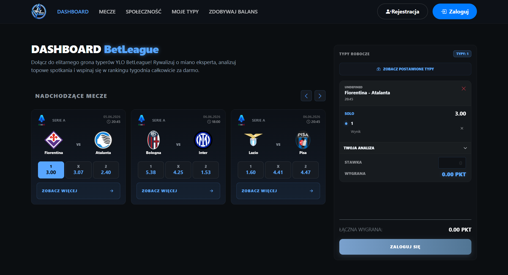
</p>

<p align="center">
    Rys. 3. Dashboard użytkownika niezalogowanego.
</p>

Gość może kliknąć wybrany kurs, aby dodać go do panelu typów roboczych. Po dodaniu typu system wyświetla przycisk **„Zaloguj się”**, informując użytkownika, że do zatwierdzenia kuponu wymagane jest posiadanie konta.

### Widok meczów

Zakładka **Mecze** umożliwia przeglądanie spotkań według daty oraz lig. Przy każdym meczu widoczne są podstawowe kursy, a rozwinięcie spotkania pozwala zobaczyć dodatkowe rynki dostępne dla danego meczu.

<p align="left">
    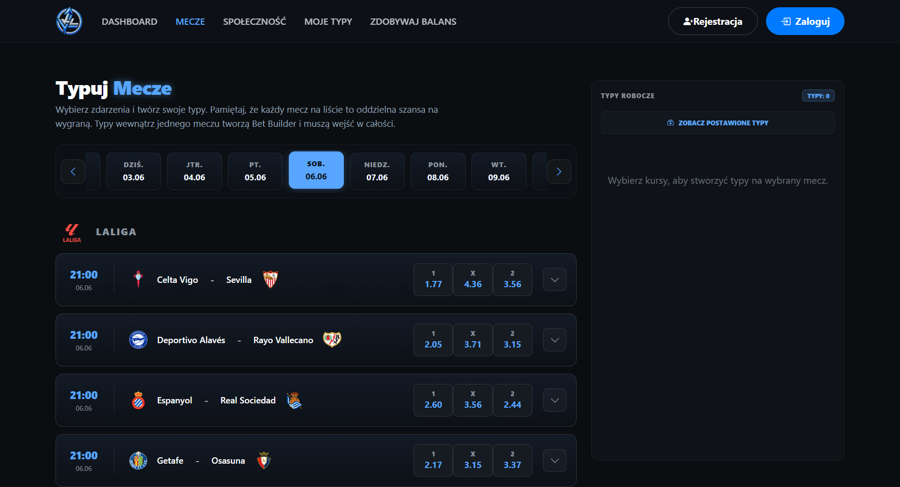
</p>

<p align="center">
    Rys. 4. Widok meczów dostępny dla użytkownika niezalogowanego.
</p>

W tym widoku gość może zapoznać się z ofertą kursową, jednak zatwierdzenie typu nadal wymaga logowania.

Po rozwinięciu wybranego spotkania użytkownik uzyskuje dostęp do wszystkich rynków przygotowanych dla danego meczu. System prezentuje między innymi zakłady na wynik spotkania, podwójną szansę, liczbę bramek, liczbę bramek drużyn, obie drużyny strzelą, rzuty rożne, kartki oraz inne dostępne zdarzenia.

<p align="left">
    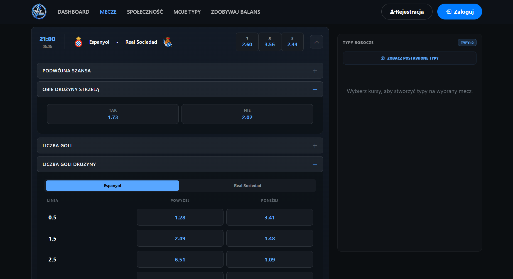
</p>

<p align="center">
    Rys. 5. Rozwinięty widok spotkania wraz z dodatkowymi rynkami zakładów.
</p>

Dzięki temu nawet użytkownik niezalogowany może analizować dostępne kursy oraz zapoznać się z pełną ofertą zdarzeń przygotowanych dla konkretnego meczu.

System umożliwia również przeglądanie spotkań historycznych. W przypadku zakończonych meczów prezentowany jest końcowy wynik spotkania, a po rozwinięciu kafelka użytkownik może przeanalizować statystyki meczowe pobrane z zewnętrznego źródła danych.

<p align="left">
    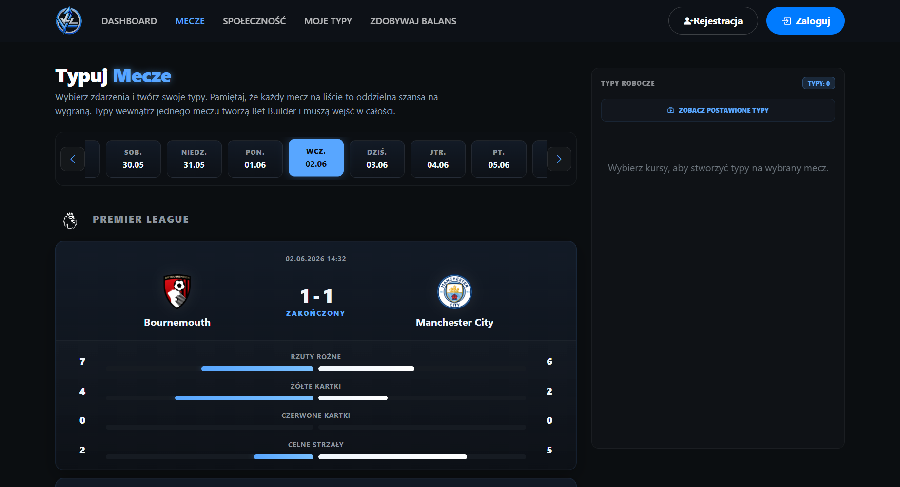
</p>

<p align="center">
    Rys. 6. Widok zakończonego spotkania wraz ze statystykami meczowymi.
</p>

Dostępne statystyki obejmują między innymi liczbę strzałów celnych, rzutów rożnych, żółtych kartek oraz czerwonych kartek dla obu drużyn. Pozwala to użytkownikowi na analizę wcześniejszych spotkań bez konieczności opuszczania platformy.

### Społeczność

Zakładka **Społeczność** umożliwia użytkownikom przeglądanie aktywności innych graczy oraz analizowanie publikowanych przez nich typów. Funkcja ta pozwala śledzić najpopularniejsze zdarzenia, porównywać skuteczność typerów oraz obserwować aktualne trendy panujące w społeczności platformy.

<p align="left">
    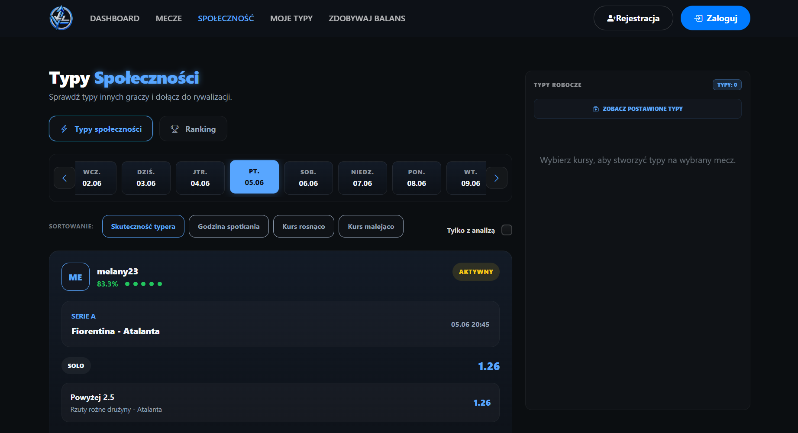
</p>

<p align="center">
    Rys. 7. Widok typów społeczności.
</p>

W zakładce **Typy społeczności** prezentowane są publiczne kupony użytkowników wraz z dodatkowymi informacjami dotyczącymi autora typu.

Dostępne informacje obejmują między innymi:

- nazwę użytkownika,
- aktualną skuteczność typowania,
- serię ostatnich rozliczonych kuponów,
- status kuponu,
- analizę użytkownika (jeśli jest dostępna),
- wybrane spotkanie,
- kurs całkowity kuponu,
- szczegóły wytypowanego zdarzenia.

Widok został wyposażony w rozbudowany system filtrowania, umożliwiający sortowanie kuponów według skuteczności autora, godziny spotkania oraz wysokości kursu. Użytkownik może również wyświetlać wyłącznie typy zawierające analizę.

Społeczność umożliwia również przeglądanie rankingów użytkowników.

<p align="left">
    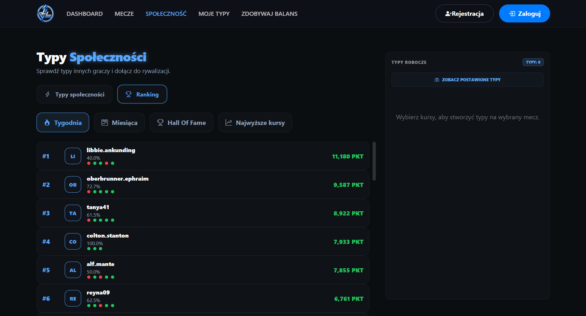
</p>

<p align="center">
    Rys. 8. Widok rankingów społeczności.
</p>

System udostępnia kilka niezależnych rankingów prezentujących najlepszych typerów platformy.

Dostępne zestawienia obejmują:

- ranking tygodniowy,
- ranking miesięczny,
- ranking Hall of Fame,
- ranking najwyższych kursów.

Rankingi aktualizowane są automatycznie na podstawie danych zapisanych w systemie i pozwalają użytkownikom śledzić własne postępy oraz porównywać wyniki z pozostałymi uczestnikami społeczności.

### Moje Typy

Zakładka **Moje Typy** służy do zarządzania własnymi kuponami oraz przeglądania historii postawionych typów. Funkcjonalność ta jest dostępna wyłącznie dla zalogowanych użytkowników.

<p align="left">
    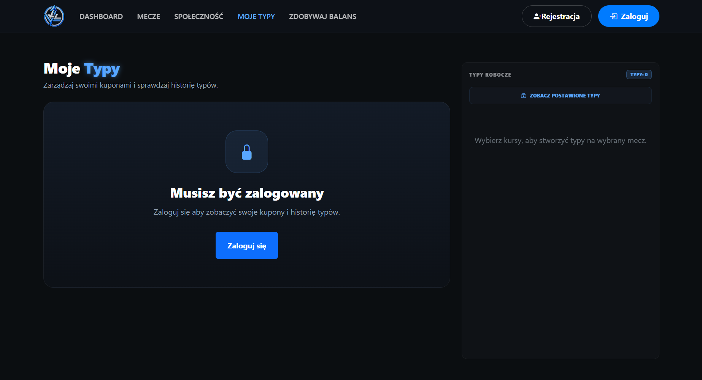
</p>

<p align="center">
    Rys. 9. Widok zakładki „Moje Typy” dla użytkownika niezalogowanego.
</p>

W przypadku wejścia do tej sekcji przez użytkownika niezalogowanego system wyświetla komunikat informujący o konieczności zalogowania się do konta.

Po zalogowaniu użytkownik uzyskuje dostęp do historii swoich kuponów, aktywnych typów, rozliczonych zakładów oraz opublikowanych analiz.

Kliknięcie przycisku **„Zaloguj się”** powoduje otwarcie formularza logowania.

### Zdobywaj Balans

Zakładka **Zdobywaj Balans** odpowiada za system nagród dostępny dla zarejestrowanych użytkowników platformy.

<p align="left">
    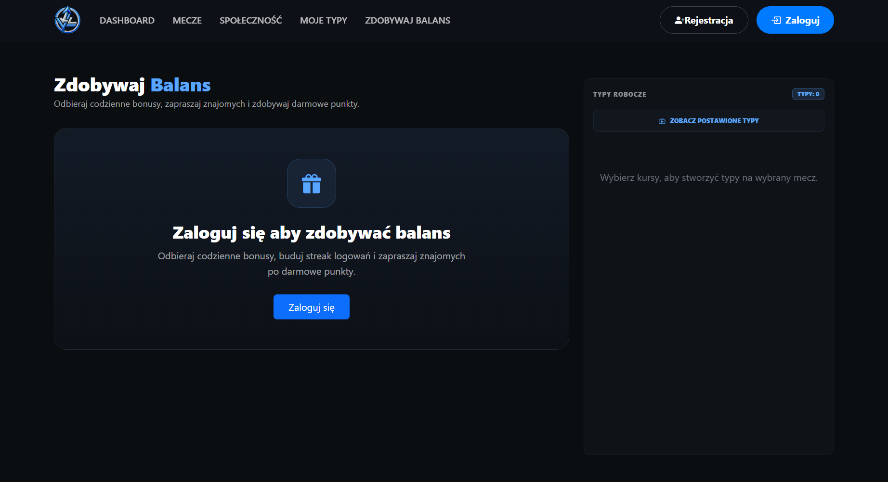
</p>

<p align="center">
    Rys. 10. Widok zakładki „Zdobywaj Balans” dla użytkownika niezalogowanego.
</p>

Użytkownik niezalogowany może zapoznać się z przeznaczeniem modułu, jednak korzystanie z jego funkcji wymaga posiadania konta oraz zalogowania do systemu.

Po zalogowaniu użytkownik uzyskuje dostęp do:

- systemu poleceń,
- indywidualnego kodu polecającego,
- codziennych bonusów za logowanie,
- nagród za utrzymywanie serii kolejnych logowań.

Kliknięcie przycisku **„Zaloguj się”** powoduje otwarcie formularza logowania.

## Rejestracja nowego konta

Aby utworzyć konto użytkownika należy kliknąć przycisk „Rejestracja”
widoczny w prawym górnym rogu strony.

<p align="left">
    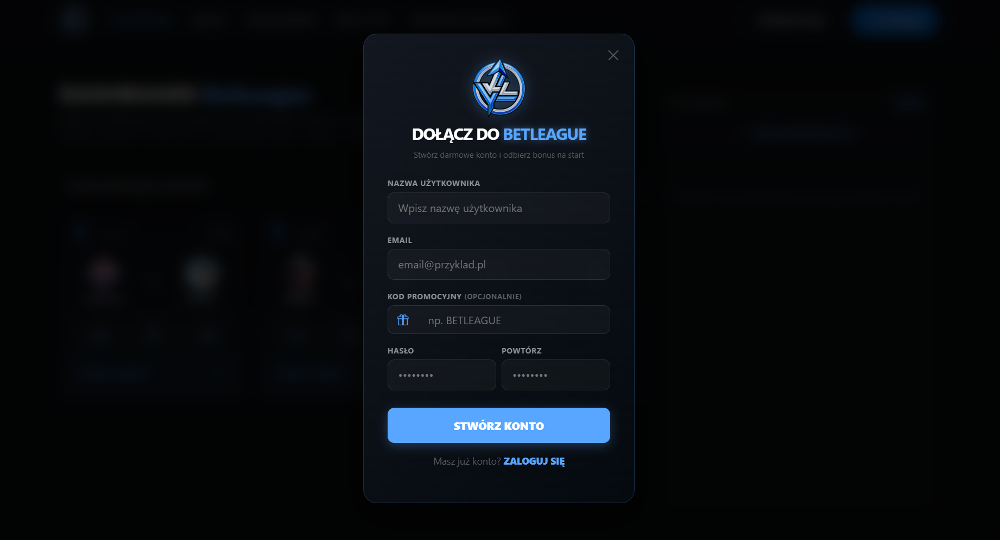
</p>

<p align="center">
    Rys. 1. Formularz rejestracji nowego użytkownika.
</p>

Formularz umożliwia utworzenie nowego konta w systemie YLO BetLeague. Użytkownik może podać opcjonalny kod polecający, który pozwala na uzyskanie dodatkowych punktów startowych.

1. Wprowadź nazwę użytkownika.
2. Wprowadź adres e-mail.
3. Opcjonalnie podaj kod polecający.
4. Ustaw hasło.
5. Potwierdź hasło.
6. Kliknij przycisk „Stwórz konto”.

Po pomyślnej rejestracji użytkownik zostaje automatycznie zalogowany i przekierowany do dashboardu użytkownika.

Jeżeli użytkownik posiada już konto, może skorzystać z odnośnika **„Zaloguj się”** znajdującego się w dolnej części formularza. Spowoduje to zamknięcie formularza rejestracji i otwarcie formularza logowania bez konieczności powrotu do strony głównej.

Dodatkowo formularz można zamknąć poprzez kliknięcie ikony zamknięcia w prawym górnym rogu okna lub kliknięcie poza obszarem modala. Powoduje to powrót do poprzedniego widoku aplikacji bez utraty aktualnie wyświetlanej strony.

## Logowanie do systemu

Użytkownik posiadający konto może zalogować się do systemu za pomocą przycisku „Zaloguj” dostępnego w nagłówku strony.

<p align="left">
    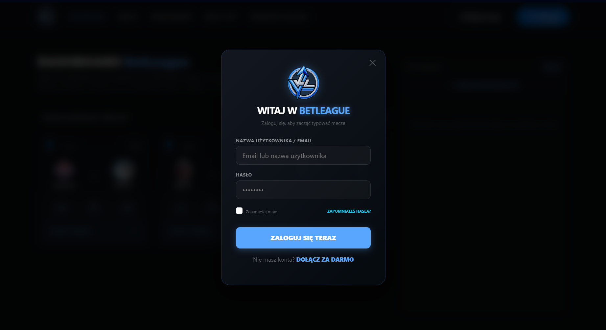
</p>

<p align="center">
    Rys. 2. Formularz logowania użytkownika.
</p>

Formularz logowania umożliwia uwierzytelnienie użytkownika przy użyciu nazwy użytkownika lub adresu e-mail.

1. Wprowadź nazwę użytkownika lub adres e-mail.
2. Wprowadź hasło.
3. Kliknij przycisk „Zaloguj się teraz”.

Po poprawnym zalogowaniu użytkownik zostaje automatycznie przekierowany do dashboardu użytkownika, gdzie uzyskuje dostęp do wszystkich funkcjonalności platformy.

Jeżeli użytkownik nie posiada jeszcze konta, może skorzystać z odnośnika **„Dołącz za darmo”**, który zamyka formularz logowania i otwiera formularz rejestracji.

Dodatkowo formularz można zamknąć poprzez kliknięcie ikony zamknięcia w prawym górnym rogu okna lub kliknięcie poza obszarem modala. Powoduje to powrót do poprzedniego widoku aplikacji bez konieczności odświeżania strony.


## Dashboard użytkownika

Po zalogowaniu użytkownik zostaje automatycznie przekierowany do dashboardu platformy. W przeciwieństwie do widoku dostępnego dla gościa, użytkownik uzyskuje pełny dostęp do funkcji związanych z tworzeniem oraz publikowaniem własnych typów.

<p align="left">
    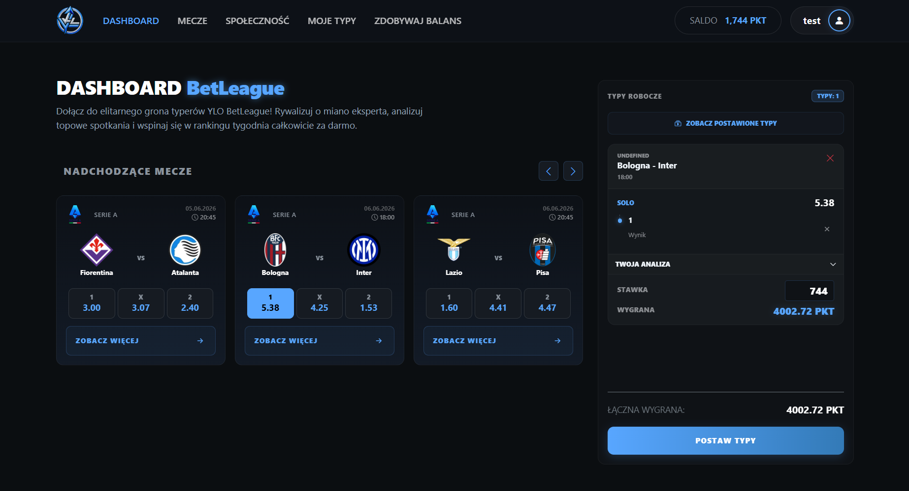
</p>

<p align="center">
    Rys. 11. Dashboard użytkownika po zalogowaniu.
</p>

Dashboard prezentuje nadchodzące spotkania wraz z podstawowymi kursami oraz umożliwia szybkie rozpoczęcie procesu tworzenia listy typów.

W prawym górnym rogu interfejsu wyświetlane są informacje o aktualnym saldzie użytkownika oraz dostęp do menu konta.

Po wybraniu kursu zdarzenie zostaje dodane do panelu typów roboczych znajdującego się po prawej stronie ekranu. Użytkownik może następnie skonfigurować kupon, określić stawkę, dodać analizę oraz zatwierdzić swój typ.

- dodać własną analizę do kuponu,
- określić wysokość stawki,
- sprawdzić potencjalną wygraną,
- usunąć wybrane zdarzenie,
- zatwierdzić wszystkie typy robocze za pomocą przycisku **„Postaw typy”**.

W przypadku, gdy użytkownik chciałby skorzystać z dodatkowych rynków zakładów dostępnych dla wybranego spotkania, może użyć przycisku **„Zobacz więcej”**. Powoduje on przejście do zakładki **Mecze** oraz automatyczne wyświetlenie dnia, w którym rozgrywane jest wybrane spotkanie. Dzięki temu użytkownik uzyskuje dostęp do wszystkich dostępnych zdarzeń i może budować bardziej rozbudowane kupony.

Panel typów roboczych jest dostępny z poziomu wszystkich głównych widoków systemu, dzięki czemu użytkownik może swobodnie przeglądać spotkania i budować kupony bez utraty wcześniej wybranych zdarzeń.

## Tworzenie i publikowanie typów

Zakładka **Mecze** umożliwia tworzenie własnych typów na dostępne spotkania. Użytkownik może wybierać zarówno pojedyncze zdarzenia typu **SOLO**, jak również budować bardziej rozbudowane typy **Bet Builder**, składające się z wielu zdarzeń dotyczących tego samego spotkania.

<p align="left">
    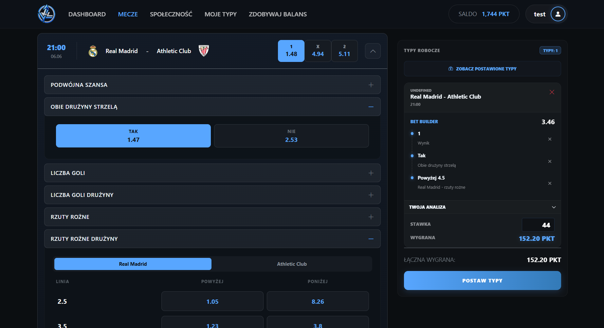
</p>

<p align="center">
    Rys. 12. Tworzenie typów oraz kuponów użytkownika.
</p>

Po wybraniu kursu zdarzenie zostaje automatycznie dodane do panelu typów roboczych znajdującego się po prawej stronie ekranu.

System rozróżnia dwa rodzaje typów:

- **SOLO** – pojedyncze zdarzenie dotyczące wybranego meczu,
- **Bet Builder** – wiele zdarzeń dotyczących tego samego spotkania, których kursy są automatycznie łączone w jeden kurs całkowity.

Typy dotyczące różnych spotkań są traktowane jako osobne typy i rozliczane niezależnie od siebie.

Dla każdego tworzonego typu użytkownik może:

- dodawać oraz usuwać zdarzenia,
- określić wysokość stawki,
- sprawdzić potencjalną wygraną,
- dodać własną analizę tekstową,
- usunąć cały typ przed jego zatwierdzeniem.

Stawka przypisywana jest indywidualnie do każdego kuponu. Dzięki temu użytkownik może jednocześnie tworzyć wiele różnych typów i zarządzać nimi niezależnie.

Po skonfigurowaniu wszystkich typów użytkownik może opublikować je jednocześnie za pomocą przycisku **„Postaw typy”**.

Po zapisaniu ich w systemie użytkownik może przejrzeć swoje aktywne oraz historyczne typy na dwa sposoby:

- korzystając z przycisku **„Zobacz postawione typy”** znajdującego się w panelu typów roboczych,
- przechodząc bezpośrednio do zakładki **„Moje Typy”**.

W momencie zapisania typu odpowiednia liczba punktów zostaje pobrana z salda użytkownika, a kupon oczekuje na rozliczenie po zakończeniu spotkania.

## Moje Typy

Zakładka **Moje Typy** umożliwia użytkownikowi przeglądanie wszystkich opublikowanych typów oraz monitorowanie ich aktualnego statusu.

<p align="left">
    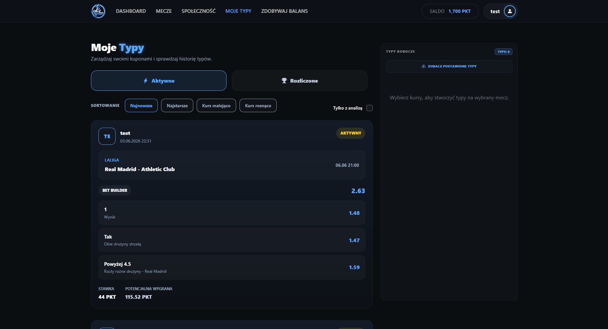
</p>

<p align="center">
    Rys. 13. Widok aktywnych typów użytkownika.
</p>

W sekcji **Aktywne** wyświetlane są wszystkie typy oczekujące na rozliczenie. Są to typy dotyczące spotkań, które jeszcze się nie zakończyły lub nie zostały jeszcze przetworzone przez system rozliczeń.

Dla każdego typu prezentowane są między innymi:

- data publikacji typu,
- nazwa rozgrywek,
- spotkanie, którego dotyczy typ,
- wybrane zdarzenia,
- kurs całkowity typu,
- wysokość stawki,
- potencjalna wygrana,
- aktualny status typu.

Dodatkowo użytkownik może korzystać z mechanizmów sortowania oraz filtrowania typów, co ułatwia odnajdywanie interesujących pozycji.

### Zarządzanie analizą typu

Jeżeli użytkownik podczas publikacji typu dodał własną analizę tekstową, może nią później zarządzać bez konieczności usuwania całego typu.

<p align="left">
    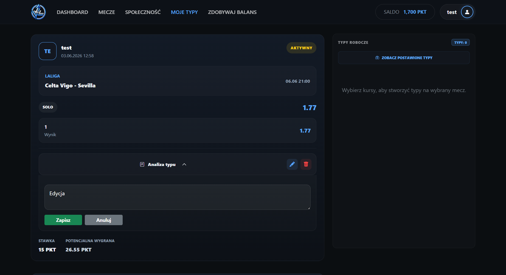
</p>

<p align="center">
    Rys. 14. Edycja analizy typu.
</p>

Do momentu rozliczenia typu użytkownik może:

- edytować treść opublikowanej analizy,
- zapisać wprowadzone zmiany,
- anulować rozpoczętą edycję,
- całkowicie usunąć analizę z typu.

Funkcja ta pozwala poprawić błędy, uzupełnić argumentację lub usunąć nieaktualne informacje bez konieczności ponownego publikowania typu.

Możliwość modyfikacji dostępna jest wyłącznie dla autora typu oraz tylko dla typów aktywnych. Po rozliczeniu typu analiza zostaje zarchiwizowana i nie może być już edytowana.

Po zakończeniu spotkania oraz wykonaniu procesu rozliczania typ zostaje automatycznie przeniesiony do sekcji **Rozliczone**.

<p align="left">
    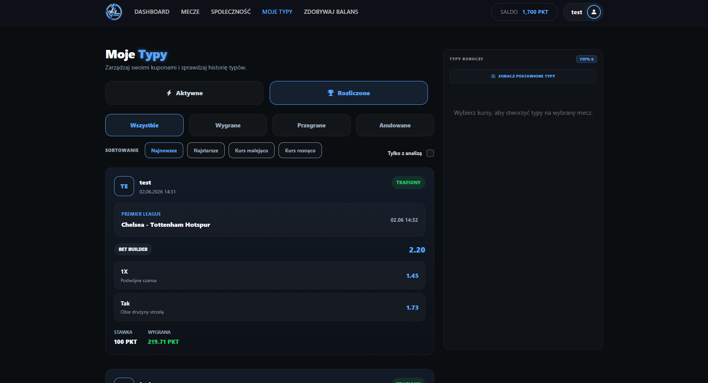
</p>

<p align="center">
    Rys. 14. Widok rozliczonych typów użytkownika.
</p>

System umożliwia przeglądanie wszystkich rozliczonych typów oraz ich filtrowanie według wyniku rozliczenia.

Dostępne są następujące kategorie:

- wszystkie typy,
- wygrane,
- przegrane,
- anulowane.

W przypadku trafionych typów system automatycznie przyznaje użytkownikowi odpowiednią liczbę punktów wynikającą z kursu oraz postawionej stawki. Informacja o uzyskanej wygranej prezentowana jest bezpośrednio na karcie typu.

Użytkownik może również wyświetlać wyłącznie typy zawierające analizę tekstową oraz sortować wyniki według daty publikacji lub wysokości kursu.

## Typy Społeczności

Zakładka **Typy Społeczności** umożliwia przeglądanie typów opublikowanych przez innych użytkowników platformy oraz analizowanie ich skuteczności.

<p align="left">
    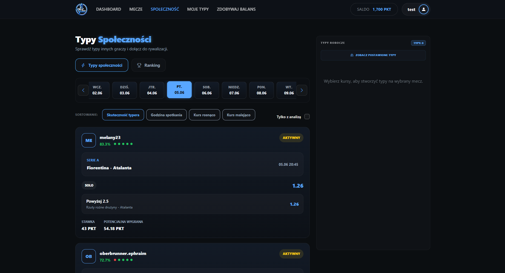
</p>

<p align="center">
    Rys. 15. Widok typów społeczności dla zalogowanego użytkownika.
</p>

Funkcjonalność działa analogicznie do widoku dostępnego dla użytkowników niezalogowanych. Użytkownik może przeglądać opublikowane typy społeczności, analizować skuteczność innych typerów oraz korzystać z dostępnych mechanizmów filtrowania i sortowania.

Dostępne filtry umożliwiają między innymi:

- sortowanie według skuteczności autora,
- sortowanie według godziny spotkania,
- sortowanie według wysokości kursu,
- wyświetlanie wyłącznie typów zawierających analizę.

Dzięki temu użytkownik może śledzić aktywność społeczności oraz wyszukiwać najbardziej interesujące typy publikowane przez innych graczy.

### Rankingi użytkowników

Zakładka **Ranking** prezentuje zestawienia najlepszych typerów platformy.

<p align="left">
    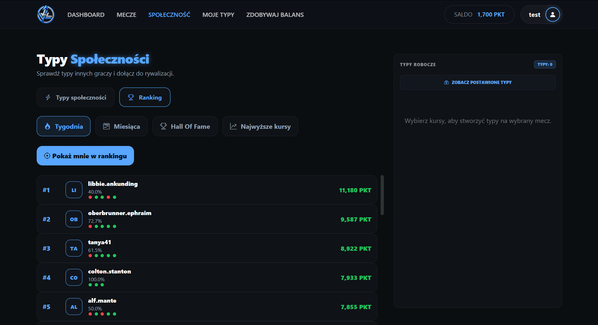
</p>

<p align="center">
    Rys. 16. Widok rankingów użytkowników.
</p>

System udostępnia kilka niezależnych rankingów:

- ranking tygodniowy,
- ranking miesięczny,
- ranking Hall of Fame,
- ranking najwyższych kursów.

Pozycja użytkownika wyliczana jest automatycznie na podstawie wyników osiąganych w systemie.

Dodatkowo zalogowany użytkownik otrzymuje dostęp do przycisku **„Pokaż mnie w rankingu”**, który automatycznie przewija ranking do aktualnej pozycji zalogowanego użytkownika.

<p align="left">
    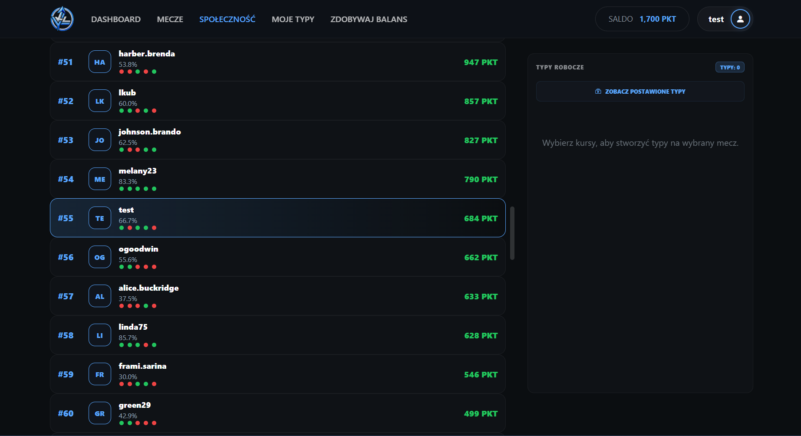
</p>

<p align="center">
    Rys. 17. Automatyczne odnalezienie pozycji użytkownika w rankingu.
</p>

Po użyciu funkcji **„Pokaż mnie w rankingu”** system automatycznie lokalizuje pozycję użytkownika w aktualnym zestawieniu oraz podświetla jego rekord, co pozwala szybko sprawdzić zajmowane miejsce bez konieczności ręcznego przeglądania całego rankingu.

## Zdobywaj Balans

Zakładka **Zdobywaj Balans** umożliwia użytkownikowi zdobywanie dodatkowych punktów wykorzystywanych do stawiania typów.

<p align="left">
    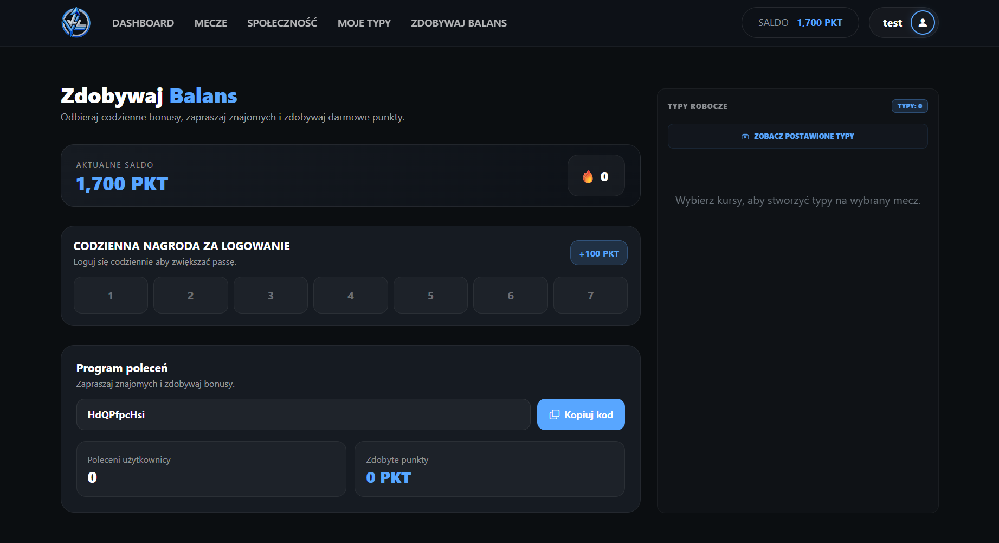
</p>

<p align="center">
    Rys. 18. System zdobywania dodatkowego balansu.
</p>

Widok prezentuje aktualne saldo użytkownika oraz informacje dotyczące aktywnych programów premiowych dostępnych w systemie.

### Codzienna nagroda za logowanie

System nagradza regularne logowanie do platformy. Każdego dnia użytkownik może odebrać premię punktową, która zwiększa jego dostępne saldo.

Kolejne logowania budują serię logowań (streak), której aktualny poziom prezentowany jest w prawej części widoku.

### Program poleceń

Każdy użytkownik otrzymuje indywidualny kod polecający, który może udostępniać innym osobom.

Po wykorzystaniu kodu podczas rejestracji nowy użytkownik zostaje przypisany do osoby polecającej, a system automatycznie nalicza odpowiednie premie punktowe.

W sekcji programu poleceń dostępne są informacje dotyczące:

- indywidualnego kodu polecającego,
- liczby pozyskanych użytkowników,
- liczby zdobytych punktów,
- przycisku umożliwiającego szybkie skopiowanie kodu do schowka.

Zdobyte punkty są automatycznie dodawane do salda użytkownika i mogą zostać wykorzystane podczas tworzenia nowych typów.

## Panel profilu użytkownika

Po kliknięciu nazwy użytkownika znajdującej się w prawym górnym rogu interfejsu zostaje wyświetlony panel profilu zawierający podstawowe informacje o koncie.

<p align="left">
    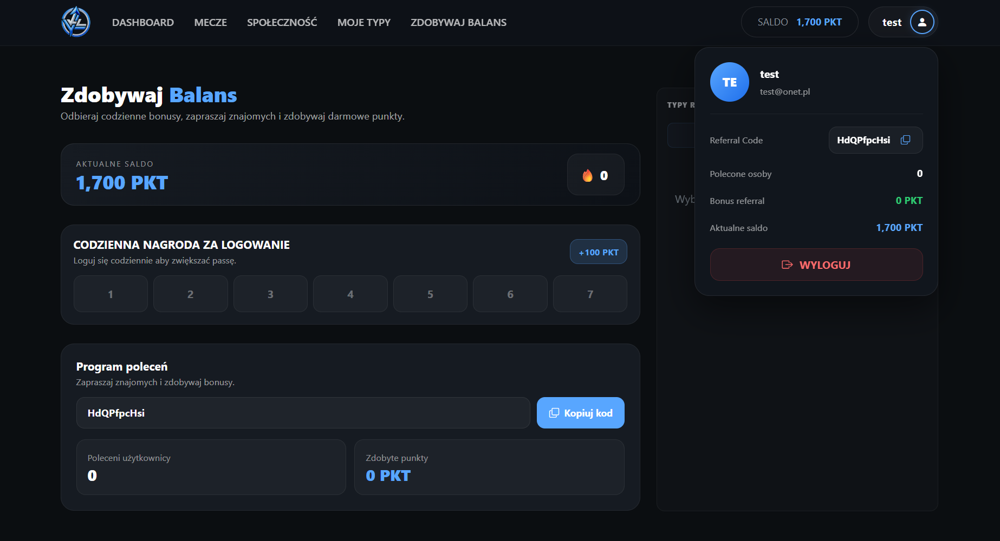
</p>

<p align="center">
    Rys. 19. Panel profilu użytkownika.
</p>

Panel profilu umożliwia szybki podgląd najważniejszych informacji związanych z kontem użytkownika.

W panelu wyświetlane są:

- nazwa użytkownika,
- adres e-mail,
- indywidualny kod polecający,
- liczba poleconych użytkowników,
- liczba punktów zdobytych z programu poleceń,
- aktualne saldo punktów.

Dodatkowo użytkownik może skopiować swój kod polecający bezpośrednio do schowka za pomocą dedykowanego przycisku.

Na dole panelu znajduje się przycisk **„Wyloguj”**, który kończy bieżącą sesję użytkownika i powoduje wylogowanie z systemu.

# Panel administratora

Administrator loguje się do systemu w identyczny sposób jak zwykły użytkownik. Podczas procesu uwierzytelniania aplikacja weryfikuje rolę przypisaną do konta. Jeżeli użytkownik posiada rolę administratora, zostaje automatycznie przekierowany do dedykowanego panelu administracyjnego zamiast do standardowych widoków użytkownika.

Panel administratora stanowi centrum zarządzania całym systemem YLO BetLeague. Umożliwia kontrolę procesu importowania danych, uruchamianie silnika analitycznego, synchronizację wyników spotkań oraz rozliczanie typów użytkowników.

<p align="left">
    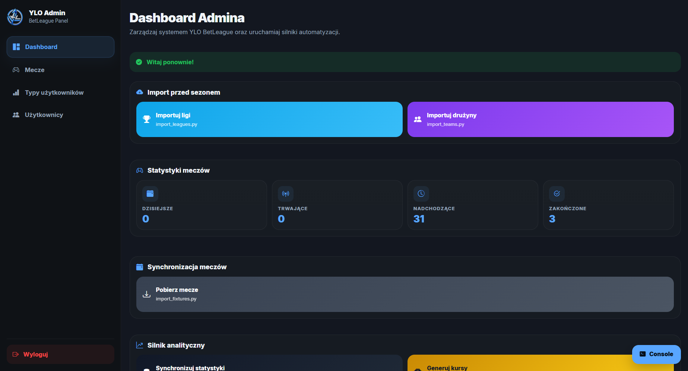
</p>

<p align="center">
    Rys. 20. Dashboard administratora – część górna.
</p>

<p align="left">
    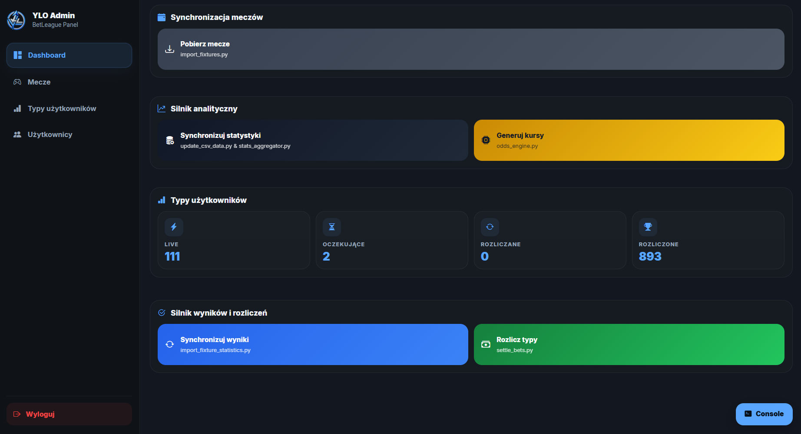
</p>

<p align="center">
    Rys. 21. Dashboard administratora – część dolna.
</p>

## Import przed sezonem

Sekcja wykorzystywana podczas inicjalizacji nowego sezonu rozgrywkowego.

### Importuj ligi

Uruchamia skrypt `import_leagues.py`, którego zadaniem jest pobranie oraz zapisanie do bazy danych wszystkich lig obsługiwanych przez system.

Operacja wykonywana jest jednorazowo przed rozpoczęciem sezonu lub po całkowitym wyczyszczeniu bazy danych.

### Importuj drużyny

Uruchamia skrypt `import_teams.py`, który pobiera wszystkie drużyny uczestniczące w zaimportowanych rozgrywkach i zapisuje je w bazie danych.

Operacja wykonywana jest po zaimportowaniu lig.

---

## Statystyki meczów

Panel prezentuje aktualny stan spotkań zapisanych w systemie.

Wyświetlane są między innymi:

- liczba dzisiejszych spotkań,
- liczba spotkań trwających,
- liczba spotkań nadchodzących,
- liczba spotkań zakończonych.

Pozwala to administratorowi szybko zweryfikować poprawność synchronizacji danych.

---

## Synchronizacja meczów

### Pobierz mecze

Uruchamia skrypt `import_fixtures.py`.

Skrypt pobiera terminarz spotkań z zewnętrznego API i zapisuje go w bazie danych aplikacji.

Operacja wykonywana jest cyklicznie podczas działania systemu. Domyślnie mecze pobierane są na 14 dni do przodu względem dnia biezącego, natomiast można to dostosować podczas konfiguracji plików .env.

---

## Silnik analityczny

Sekcja odpowiedzialna za przygotowanie danych wejściowych wykorzystywanych przez model analityczny.

### Synchronizuj statystyki

Uruchamia skrypty:

- `update_csv_data.py`
- `stats_aggregator.py`

Pierwszy skrypt pobiera historyczne statystyki drużyn z plików źródłowych, natomiast drugi agreguje i przetwarza dane do postaci wykorzystywanej przez model analityczny.

Proces ten przygotowuje komplet danych wejściowych niezbędnych do generowania kursów.

### Generuj kursy

Uruchamia skrypt `odds_engine.py`.

Jest to główny moduł analityczny projektu wykorzystujący model Poissona do wyliczania prawdopodobieństw zdarzeń sportowych.

Na podstawie przygotowanych statystyk generowane są kursy dla wszystkich dostępnych rynków zakładów i zapisywane w bazie danych.

---

## Typy użytkowników

Sekcja prezentuje aktualny stan wszystkich typów znajdujących się w systemie.

Wyświetlane są:

- typy aktywne,
- typy oczekujące na rozliczenie,
- typy w trakcie rozliczania,
- typy już rozliczone.

Pozwala to administratorowi monitorować poprawność działania procesu rozliczeń.

---

## Silnik wyników i rozliczeń

Sekcja odpowiedzialna za końcowy etap działania systemu.

### Synchronizuj wyniki

Uruchamia skrypt `import_fixture_statistics.py`.

Skrypt pobiera oficjalne wyniki zakończonych spotkań oraz szczegółowe statystyki meczowe wykorzystywane podczas rozliczania typów.

Do systemu trafiają między innymi:

- wynik spotkania,
- liczba bramek,
- liczba rzutów rożnych,
- liczba kartek,
- liczba celnych strzałów.

### Rozlicz typy

Uruchamia skrypt `settle_bets.py`.

Na podstawie pobranych wyników system automatycznie weryfikuje wszystkie nierozliczone typy użytkowników.

Dla każdego typu wykonywane jest:

- sprawdzenie poprawności wytypowanych zdarzeń,
- określenie statusu wygrany/przegrany/anulowany,
- wyliczenie końcowej wygranej,
- aktualizacja salda użytkownika,
- oznaczenie typu jako rozliczony.

Proces ten stanowi końcowy etap cyklu życia typu w systemie.

---

## Konsola administracyjna

W prawym dolnym rogu panelu znajduje się przycisk **Console**.

<p align="left">
    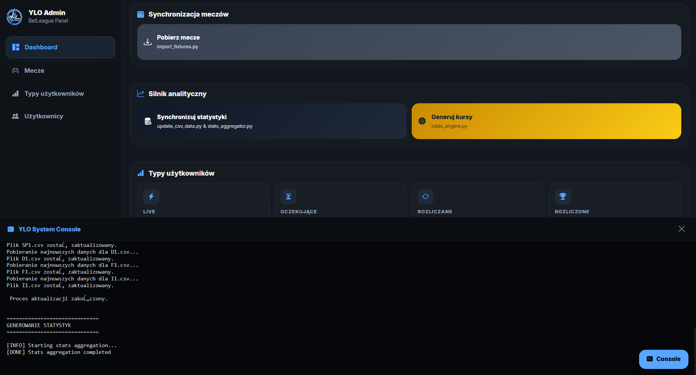
</p>

Po jego kliknięciu administrator otrzymuje dostęp do konsoli wykonania skryptów, w której prezentowane są komunikaty zwracane przez uruchamiane moduły Pythona.

Pozwala to na bieżące monitorowanie przebiegu importów, synchronizacji danych oraz działania silnika analitycznego.

## Zarządzanie meczami

Moduł **Mecze** umożliwia administratorowi przegląd wszystkich spotkań zapisanych w systemie z podziałem na daty oraz ligi.

<p align="left">
    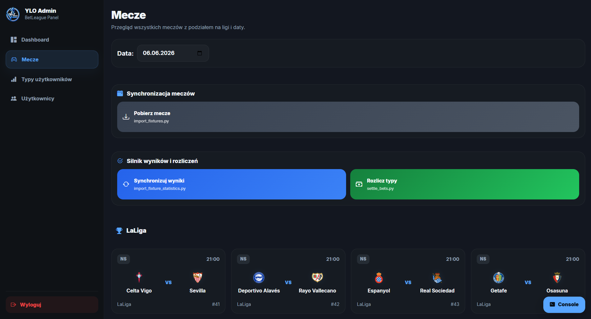
</p>

<p align="center">
    Rys. 22. Zarządzanie meczami.
</p>

Administrator może:

- filtrować mecze według wybranej daty,
- przeglądać wszystkie spotkania zapisane w bazie danych,
- monitorować status poszczególnych spotkań,
- ponownie uruchomić synchronizację terminarza,
- synchronizować wyniki zakończonych spotkań,
- ręcznie uruchamiać proces rozliczania typów.

Widok ten pełni przede wszystkim funkcję kontrolną i pozwala szybko zweryfikować poprawność pobranych danych meczowych.

---

## Zarządzanie typami użytkowników

Moduł **Typy użytkowników** umożliwia administratorowi monitorowanie wszystkich typów znajdujących się w systemie.

<p align="left">
    
</p>

<p align="center">
    Rys. 23. Przegląd typów użytkowników.
</p>

Administrator może:

- filtrować typy według daty,
- filtrować typy według konkretnego użytkownika,
- przeglądać aktywne i rozliczone typy,
- analizować skuteczność poszczególnych typerów,
- monitorować aktywność społeczności.

Dla każdego typu prezentowane są informacje takie jak:

- autor typu,
- skuteczność użytkownika,
- spotkanie, którego dotyczy typ,
- kurs,
- stawka,
- potencjalna wygrana,
- aktualny status typu.

### Analizy użytkowników

Jeżeli użytkownik podczas tworzenia typu dodał własną analizę tekstową, administrator może ją wyświetlić bezpośrednio z poziomu panelu.

<p align="left">
    
</p>

<p align="center">
    Rys. 24. Podgląd analizy użytkownika.
</p>

Pozwala to monitorować jakość publikowanych analiz oraz kontrolować treści udostępniane społeczności.

---

## Zarządzanie użytkownikami

Moduł **Użytkownicy** odpowiada za administrację kontami znajdującymi się w systemie.

<p align="left">
    
</p>

<p align="center">
    Rys. 25. Lista użytkowników.
</p>

Administrator może:

- wyszukiwać użytkowników po nazwie,
- sortować użytkowników,
- przeglądać statystyki kont,
- edytować dane użytkowników,
- nakładać blokady czasowe,
- usuwać konta.

Dla każdego użytkownika prezentowane są:

- nazwa użytkownika,
- adres e-mail,
- rola systemowa,
- aktualne saldo,
- liczba postawionych typów,
- skuteczność typowania,
- aktualna seria trafionych typów,
- najlepsza seria trafionych typów.

### Edycja użytkownika

Po rozwinięciu wybranego rekordu administrator uzyskuje dostęp do formularza edycji.

<p align="left">
    
</p>

<p align="center">
    Rys. 26. Edycja użytkownika.
</p>

Administrator może:

#### Modyfikować dane konta

Dostępna jest możliwość zmiany:

- nazwy użytkownika,
- adresu e-mail,
- roli systemowej.

Zmiany zapisywane są bezpośrednio w bazie danych.

#### Nakładanie blokady konta

Administrator może określić datę wygaśnięcia blokady.

Do momentu upływu wskazanego terminu użytkownik nie będzie mógł korzystać z systemu.

Mechanizm ten pozwala czasowo ograniczyć dostęp bez konieczności usuwania konta.

#### Usuwanie użytkownika

Administrator może całkowicie usunąć konto użytkownika.

Operacja powoduje usunięcie:

- danych konta,
- historii typów,
- analiz użytkownika,
- wszystkich rekordów powiązanych z kontem.

Z tego względu przed wykonaniem operacji wyświetlane jest dodatkowe ostrzeżenie.

---

## Plany rozbudowy
Projekt mógłby zostać wzbogacony o nowe moduły, które zwiększą zaangażowanie społeczności oraz głębię analityczną platformy:

### Rozwój społecznościowy
* **Moduł czatu:** Implementacja komunikatora w czasie rzeczywistym, umożliwiającego wymianę analiz i emocji między użytkownikami podczas meczów.
* **System rang i odznak:** Wprowadzenie progresywnego systemu poziomów oraz odznak za osiągnięcia.
* **Rankingi ligowe:** Tworzenie sub-grup (prywatnych lig) dla znajomych, pozwalających na rywalizację wewnątrz zamkniętych kręgów.
* **Lista znajomych:** Możliwość dodawania użytkowników do znajomych i rywalizacji w rankingach ze znajomymi.
* **Obserwowanie:** System śledzenia aktywności najlepszych analityków ("Follow"), aby otrzymywać powiadomienia o ich nowych typach.
* **Personalizacja:** Możliwość wyboru "Ulubionych lig" i "Ulubionych zespołów", co pozwoli na filtrowanie widoku meczów i otrzymywanie dedykowanych powiadomień.

### Ekspansja danych i dyscyplin
* **Wielokierunkowość sportowa:** Rozszerzenie silnika analitycznego o obsługę innych dyscyplin (np. koszykówka NBA, tenis, e-sport), co wymaga dostosowania `python_engine` do pracy z nowymi modelami statystycznymi.
* **Globalny zasięg lig:** Zwiększenie bazy dostępnych rozgrywek poza obecnie obsługiwane TOP-5 lig europejskich oraz UEFA Champions League.
* **Rozszerzone statystyki (Deep Stats):** Implementacja bardziej zaawansowanych parametrów (np. posiadanie piłki, xG - expected goals, mapy strzałów), które będą brane pod uwagę przez silnik `odds_engine` przy generowaniu kursów.
